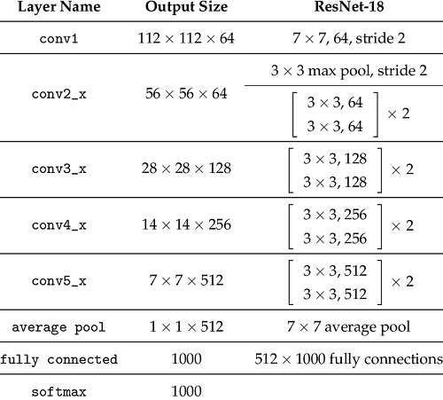
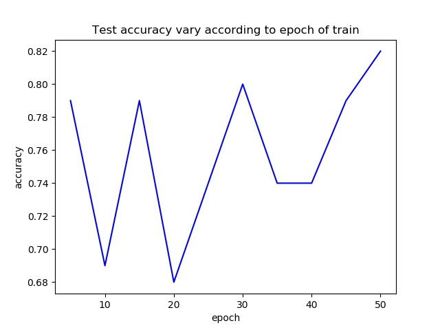
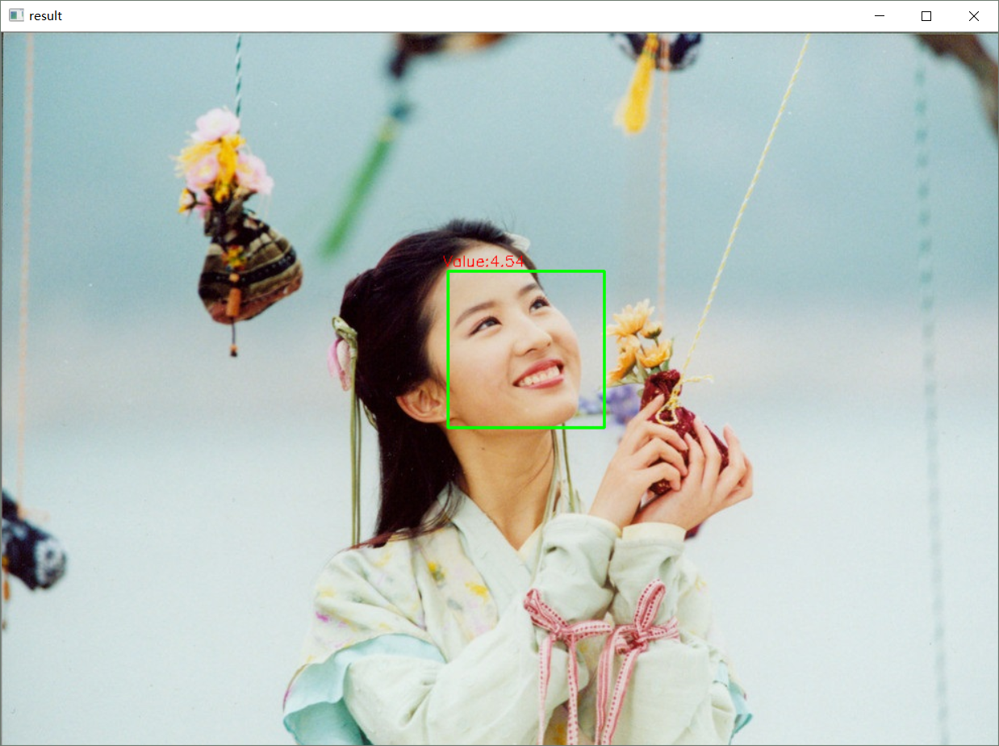

# isBeauty
```sh
Facial Beauty Predictor based on SCUT-FBP5500-Database, If the predict result is not ideal, just take it as a joke~
Everybody is beautiful/handsome~~~
You can star this repository to keep track of the project if it's helpful for you, thank you for your support.
```

# Introduction in Chinese
https://mp.weixin.qq.com/s/5eVFPMiFA8VhYYlTHlNh1A

# Dependencies
- pytorch==0.4.1
- torchvision
- numpy
- opencv-python
- scikit-image
- matplotlib
- pandas
- pillow
- dlib
- argparse

# Environment
- Ubuntu 16.04(train) / Windows10(test)
- python 3.5+(have installed the neccessary dependencies)
- Graphics: Tian XP

# Model I used
#### baseline

#### some changes
```sh
Remove the softmax and change the output size of FC(1000 → 1).
```

# Train
#### Step1
```sh
Install the neccessary dependencies and download the dataset from https://github.com/HCIILAB/SCUT-FBP5500-Database-Release.
```
#### Step2
```sh
Modify the config.py according to your needs.
Explanations and defaut values of the hyperparameters:
	# trainset - images dir.
	imagespath = './SCUT-FBP5500_v2/Images'
	# trainset - ground truth path.
	labpath = 'SCUT-FBP5500_v2/All_Ratings.xlsx'
	# image shape of network input.
	img_shape = (224, 224)
	# whether shuffle the trainset or not.
	is_shuffle = True
	# batch size while training and testing.
	batch_size = 64
	# the number of worker.
	num_workers = 4
	# whether use GPU or not while training and testing.
	use_cuda = True
	# assign the ids of gpu.
	gpus = '0,1'
	# the number of used gpu.
	ngpus = 2
	# the number of epoch while training.
	num_epochs = 50
	# save the model parameters every save_interval epoch.
	save_interval = 5
	# dir to save the model parameters.
	backupdir = './weights'
	# file to save log info while training and testing.
	logfile = 'train.log'
	# if the distance of pred and groundtruth is smaller than error_tolerance, we regard the pred as a right one.
	error_tolerance = 0.5
```
#### Step3
```sh
run "python train.py"
```

# Test
```sh
Command format:
	python predict.py -i img_path -m model_path"
for example:
	python predict.py -i testPic/test.jpg -m weights/epoch_50.pkl
```

# Result
#### train

#### test


# More
#### WeChat Official Accounts
*Charles_pikachu*  
